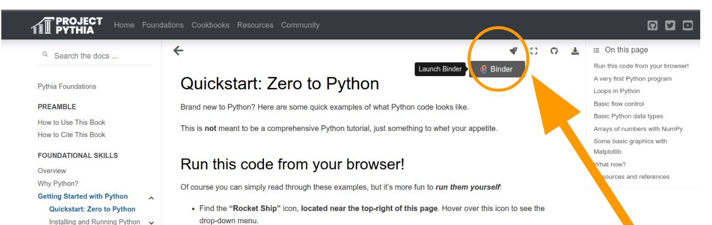

# Prerequisites and preparatory materials for Computational Tools for Climate Science

Welcome to the [Climatematch Academy](https://academy.climatematch.io/about/mission)! We're really excited to bring this course to such a wide and varied audience. We want to make sure every student is able to follow and enjoy the academy. This means you need to know the basics of programming in Python, math and science core concepts. Below 👇 we provide more details for each.

## Contents

* [Programming](#Programming)
* [Algebra](#algebra)
* [Linear Algebra](#linear-algebra)
* [Statistics](#statistics)
* [Calculus](#calculus)
* [Physics](#physics)
* [Chemistry](#chemistry)
* [Climate Science](#climate-science)

## Programming

We expect students to be familiar with the following topics in Python: variables, lists, dictionaries, the numpy, matplotlib, cartopy, datetime, pandas and data formats. Students who are not familiar with some of the topics mentioned before, are required to take the **Python pre-course**, which offers asynchronous support for a selection of tutorials from Project Pythia. 

What is Project Pythia? Check out the fantastic [~5min video](https://bit.ly/42P799Y) that Julia Kent prepared for you as an intro to this fabulous material.

Now, let's sumarize what are the lessons you need to review:

- [Preamble and Foundational Skills](https://bit.ly/4429kYQ): Overview, Why Python, Quickstart: Zero to Python (under the heading “Getting Started with Python”), JupyterLab (under the heading “Getting Started with Jupyter”), What is Github (under the heading “Getting Started with GitHub”) (~3.5 hours)
    
- Core Scientific Python Packages: NumPy, Matplotlib, Cartopy, Datetime, Pandas, Data formats (~6 hours). Xarray will be a part of the course Computational Tools for Climate Science, so you do not need to learn it beforehand.
    

- Here [is a breakdown of times per lesson](https://bit.ly/3CHhjid). The topics highlighted in blue are the only mandatory lessons that we expected you have covered in preparation for the course Computational Tools for Climate Science. 
    

  

You will work through the material at your own pace, getting asynchronous help on Discord as needed during July 12-14. To ensure clarity and set proper expectations, let’s revisit what you can expect from the **Python pre-course** and what you should not expect.

**What You Can Expect from the Python pre-course**

- Asynchronous Support via Discord: Throughout the duration of the precourse, (July 12-14), our team will provide support through the Discord platform. You will have the opportunity to ask questions and seek assistance via chat. Please note that we will not be conducting any video calls or virtual classes during the Python pre-course.
    

  

- Self-Study Approach: The precourse is not designed as a traditional course with lectures and guided lessons. Instead, we have curated a collection of comprehensive learning materials for you to study independently. These materials are accessible through the link provided. It is essential that you dedicate sufficient time and effort to self-study the content at your own pace.
    
- Prior Programming Experience Advantage: If you have prior experience in programming, you may find this precourse relatively easier to grasp. 
    

 - For those without any previous programming background, it is crucial to start studying the material well in advance. We recommend beginning as early as possible to ensure you have ample time to cover the content. Practice every day and you'll be in great shape before July 17th.
    
- You won't need to install Python on your computer for the Python pre-course. You literally just need to hit the rocket-shaped button in the upper right corner of the lessons (see image below) and sign in using your Github account. 

 

  

- The section [“How to use this book”](https://foundations.projectpythia.org/preamble/how-to-use.html#how-to-use-this-book) provides you with alternative options to run the Python code.

- If nothing works, please don’t panic. Sometimes depending on your region, your internet access, and your computer, some challenges may arise, but we will be happy to assist you. Please email  [python_precourse@climatematch.io](mailto:python_precourse@climatematch.io) if you need help.
    

**What You Should Not Expect  from the Python pre-course**

- Guided Instruction: Please be aware that the Python precourse does not include virtual online classes or guided instruction. While our team will be available for support via Discord chat during July 12-14, the onus is on you to study the material independently and seek clarification as needed.
    

  

- Traditional Classroom Environment: Unlike traditional courses where you attend classes and follow a set schedule, the precourse relies on your self-motivation and discipline to study the provided materials. There will not be any fixed class times or mandatory attendance.
    

  

- In-depth Coverage of Advanced Topics: The Python pre-course primarily focuses on introducing the fundamentals of Python programming. It does not delve into advanced topics.
    

  

>Extra material
>
>We recommend the [Software carpentry 1-day Python tutorial](https://swcarpentry.github.io/python-novice-inflammation/) or the free Edx course [Using Python for Research](https://www.edx.org/course/using-python-for-research). For a more in-depth intro, see the [scipy lecture notes](https://scipy-lectures.org/). Finally, you can follow the [Python data science handbook](https://jakevdp.github.io/PythonDataScienceHandbook/), which also has a print edition. 
If you're coming from a Matlab background, you can quickly get up to speed with [this cheatsheet](https://cheatsheets.quantecon.org/). 

## Math 

  

Climatematch Academy relies on linear algebra, probability, basic statistics, and calculus (derivatives, integrals, and ordinary differential equations -ODEs).

  

### Algebra
If you need a refresher on basic, pre-calculus algebra check the videos in this [Algebra course](https://bit.ly/3Pnq5cP) from Khan Academy. You will particularly need to know your way around [functions](https://bit.ly/43H5mox) (unit 8 of the course) and their representations, including graphics, because they are the way to express relationships between variables and they are the basic elements you work with in Calculus. 

  

### Linear algebra
You will need a good grasp of the basics of linear algebra to follow along, as linear algebra is crucial for almost anything quantitative involving more than one number at a time. It will also help you visualize and understand the way data are organized and manipulated, particularly in computational environments. You need to have a basic understanding of vectors and matrices, and how to perform operations with them. We recommend watching the videos in these units about [vectors](https://bit.ly/3NcM2IK) and [matrices](https://bit.ly/3CDXurX) from Khan Academy. That should be enough to prepare you for CMA. 

> Extra material. 
>
>If you get curious and want to build a strong background in linear algebra, we recommend [W0D3](https://compneuro.neuromatch.io/tutorials/W0D3_LinearAlgebra/chapter_title.html) from Neuromatch Academy, or this [beautiful lecture series](https://www.youtube.com/playlist?list=PLZHQObOWTQDPD3MizzM2xVFitgF8hE_ab). Another great resource is this [Linear Algebra Course](https://www.khanacademy.org/math/linear-algebra) from Khan Academy. Here is a series of exercises on [linear algebra in Python](https://www.w3resource.com/python-exercises/numpy/linear-algebra/index.php).

  

### Statistics
Understanding statistics is also important; you should be comfortable with mean/median/mode, standard deviations, variances, the normal distribution, and linear regression. We recommend the [Statistics and probability course](https://bit.ly/3CGx6h2) (videos in units 3, 4 and 5) from Khan Academy. 

  

### Calculus
Finally, basic calculus is crucial; you should know what integrals and derivatives are, and understand what a differential equation means. If you need to refresh your memory on differential and integral calculus, we recommend the [Calculus course](https://bit.ly/3Nk4sXV) from Khan Academy (videos in units 2, 5, 6, and 7). Remember that you don’t need to learn all the details and be able to solve complicated problems, just make sure you understand the concepts. We also recommend [these simulations](https://phet.colorado.edu/en/simulations/filter?subjects=math&levels=university&type=html,prototype) from PHET to help illustrate some mathematical concepts.

> Extra material:
>  
 >For additional reading, [Gilbert Strang's book](https://ocw.mit.edu/ans7870/resources/Strang/Edited/Calculus/Calculus.pdf) is a good refreshment book: Chapters 1 (sections 1.1-1.3), 2, 3 (sections 3.1-3.4), 5, 13 (sections 13.1-13.2), and 16 (section 16.2). This book also has chapters on Vectors and Matrices (Chapter 11), and Linear Algebra (section 16.1). For differential equations, we also recommend reading sections 0.2 and 0.3 of Jiri Lebl's book ["Differential equations for engineers"](https://www.jirka.org/diffyqs/). 

  

## Science

  

### Physics
Climate processes are governed by the laws of physics which is why you will need a general understanding of basic physics concepts such as: Newton’s laws of motion, forms of energy, conservation of energy, circular motion (Earth’s rotation and Coriolis force), waves, electromagnetic spectrum, optics, heat, and thermodynamics, etc.

Recommended references include the videos from the [College Physics 1](https://www.khanacademy.org/science/ap-college-physics-1) course from Khan Academy for kinematics, Newton’s laws, dynamics, energy, and mechanical waves), the videos from the [College Physics 2](https://www.khanacademy.org/science/ap-physics-2) course from Khan Academy for Heat and Thermodynamics (unit 2), electromagnetic waves (unit 6), and optics (unit 7), and [Dave Van Domelen](https://stratus.ssec.wisc.edu/courses/gg101/coriolis/coriolis.html)’s, [Encyclopedia Britannica](https://www.britannica.com/science/Coriolis-force) or [Wikipedia](https://en.wikipedia.org/wiki/Coriolis_force) entries on Coriolis force. 

Remember that you don’t need to learn all the details and be able to solve complicated problems, just make sure you understand the concepts. We also recommend [these simulations](https://phet.colorado.edu/en/simulations/filter?subjects=motion,sound-and-waves,work-energy-and-power,heat-and-thermodynamics,light-and-radiation&levels=university&type=html,prototype) from PHET to help illustrate some concepts.

 > Extra material:
>  
> For a more comprehensive refresher, we recommend Urone, Hinrichs, and Dirks’ [College Physics book](https://open.umn.edu/opentextbooks/textbooks/61): for Newton’s laws of motion (chapter 4 up to section 4.4), circular motion (chapter 6 up to section 6.4), conservation of energy (chapter 7 up to section 7.6), heat and thermodynamics (chapter 13 except section 13.4, chapter 14, chapter 15 except sections 15.2, 15.5, and 15.7), waves (Sections 16.9-16.11), electromagnetic spectrum (sections 24.3, 24.4), optics (chapter 25 up to section 25.5). 

  
  
  

### Chemistry
It would be helpful to have general chemistry knowledge regarding atoms, isotopes, molecules, ions, compounds, bonds, etc. We recommend the [College Chemistry course](https://www.khanacademy.org/science/ap-chemistry-beta) (videos in units 1, 2, and 3) from Khan Academy. There is no need to learn all the details and be able to solve complicated problems, just make sure you understand general concepts. We also recommend [these simulations](https://phet.colorado.edu/en/simulations/filter?subjects=general&levels=university&type=html,prototype) from PHET to help illustrate some concepts.

 > Extra material:
 > 
 >For additional reading, we also recommend Flowers, Theopold, Langley, and Robinson’s [Chemistry 2e](https://openstax.org/details/books/chemistry-2e) book (sections 1.2, 1.3, 2.3-2.6, 2.7 is optional). 

  

### Climate Science

If you're coming from outside climate science, it'll be great to familiarize yourself with fundamental concepts. Watch this [video](https://bit.ly/3NEDdsJ), to build some context for CMA. As a good accompanying resource for CMA and if you’d like to learn more about climate science, we highly recommend Andreas Schmitner’s [Introduction to Climate Science](https://open.umn.edu/opentextbooks/textbooks/860) book.

  
  

We're excited to have you here! Looking forward to meeting you soon,

  

The Climatematch Academy Team.
